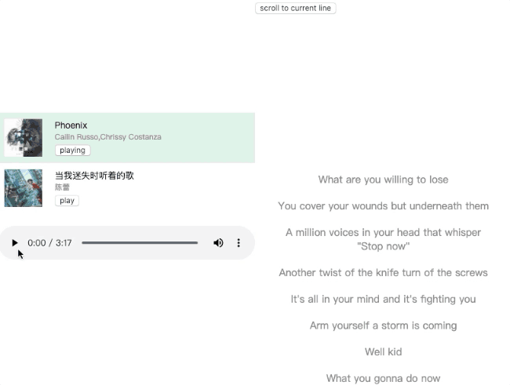
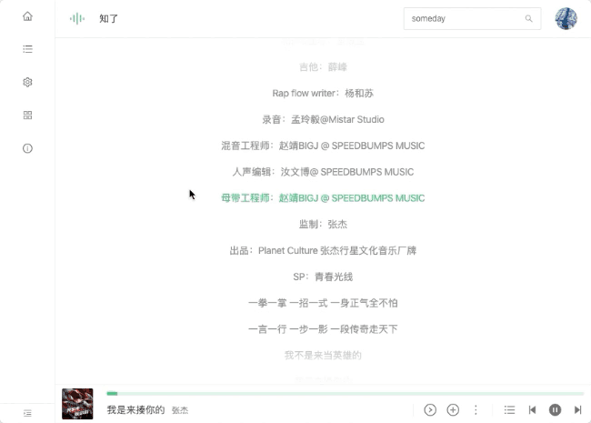

# react-lrc

The react component that display lyric from lrc format.

## Feature

- auto scroll smoothly
- user srcollable
- custom style

## Example

- [https://mebtte.github.io/react-lrc](https://mebtte.github.io/react-lrc)

## Case





## Requirement

- `react >= 16.8` with `hook`

## Usage

```sh
npm install --save @mebtte/react-lrc
```

```jsx
import { Lrc, LrcLine } from '@mebtte/react-lrc';

const Lyric = ({ lrc }) => (
  <Lrc lrc={lrc}>
    {({ millisecond, content }, active) => (
      <LrcLine key={millisecond} style={{ color: active ? 'red' : 'gray' }}>
        {content}
      </LrcLine>
    )}
  </Lrc>
);

export default Lyric;
```

### `Lrc` Props

| prop                      | description                                   | type                                                                                                      | required | default |
| ------------------------- | --------------------------------------------- | --------------------------------------------------------------------------------------------------------- | -------- | ------- |
| lrc                       | lrc string                                    | string                                                                                                    | true     |         |
| children                  | lrc line render method, must return `LrcLine` | (lrcLine: { millisecond: number, content: string }, active: boolean, index: number) => ReactNode<LrcLine> | true     |         |
| currentTime               | current time                                  | number is **millisecond**                                                                                 | false    | 0       |
| autoScrollAfterUserScroll | recover auto scroll after user scroll         | number is **millisecond**                                                                                 | false    | 5000    |
| [key: string]             | any props like `style`/`className`...         | any                                                                                                       | false    |         |

### `Lrc` Methods

| method              | description                                                | type       |
| ------------------- | ---------------------------------------------------------- | ---------- |
| scrollToCurrentLine | call this it will scroll to current line after user scroll | () => void |

### `LrcLine` Props

| prop          | description                           | type | required | default |
| ------------- | ------------------------------------- | ---- | -------- | ------- |
| [key: string] | any props like `style`/`className`... | any  | false    |         |

## Question

### How to hide the scrollbar ?

```css
.hide-scrollbar {
  &::-webkit-scrollbar {
    width: 0;
  }
}
```

```jsx
<Lrc className="hide-scrollbar">...</Lrx>
```

It only works on `-webkit-`.

### How to prevent user scroll ?

```jsx
<Lrc style={{ overflow: 'hidden !important' }} autoScrollAfterUserScroll={0}>
  ...
</Lrc>
```

### Could not auto scroll to correct line after `Lrc` resized ?

`window.resize` is supportted, but `Lrc.resize` is not, because i don't know how to inspect `Lrc` resize, if you know how please [tell me](https://github.com/mebtte/react-lrc/issues/1), thanks very much.

## License

MIT
