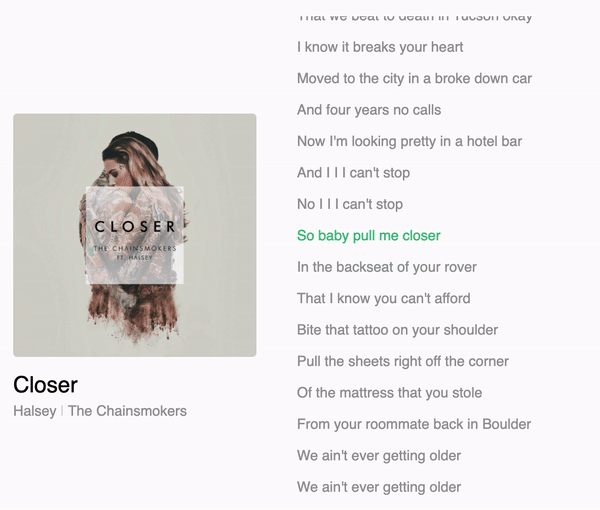
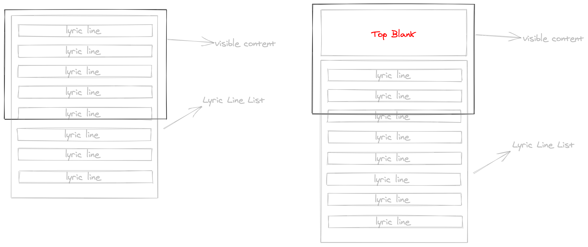
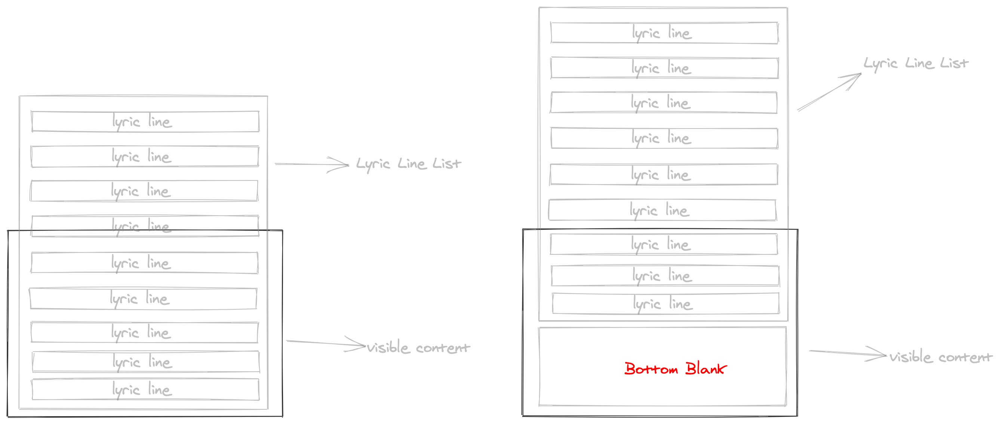

# react-lrc [](https://www.npmjs.com/package/react-lrc) [](https://github.com/mebtte/react-lrc/blob/master/LICENSE) 

The react component that display lrc format. Play it on [online playground](https://mebtte.github.io/react-lrc).



## [1.x README](https://github.com/mebtte/react-lrc/blob/74df10e762b12fce1ca54bab27a6d4844be25503/README.md)

## Feature

- Auto scroll smoothly
- User srcollable
- Custom style
- Typescript support

## Examples

- [Playground](https://mebtte.github.io/react-lrc)
- [Static lyric viewer](https://codesandbox.io/s/staticlyricviewer-6g6zq)
- [Load lrc from remote with transition](https://codesandbox.io/s/loadlrcfromremotewithtransition-1qoze)

## Requirement

- `react >= 16.8` with `hook`.
- [ResizeObserver](https://caniuse.com/?search=ResizeObserver), you should add [polyfill](https://github.com/que-etc/resize-observer-polyfill) probably.

## Usage

```sh
npm install --save react-lrc
```

### Lrc Component

```jsx
import { Lrc } from 'react-lrc';

const Demo = () => {
  // ...
  return (
    <Lrc
      lrc={lrc}
      lineRenderer={lineRenderer}
      currentMillisecond={currentMillisecond}
    />
  );
};
```

#### Props

##### lrc: string

The lrc string.

##### lineRenderer: ({ index: number, active: boolean, line: LyricLine }) => React.ReactNode

Lyric line's renderer. When `active` is `true` means it is current line. `LyricLine` is exported from [clrc](https://github.com/mebtte/clrc).

##### currentMillisecond?: number

Current time of lrc string. default `0`.

##### autoScroll?: boolean

Whether to scroll when `currentMillisecond` changed. default `true`;

##### intervalOfRecoveringAutoScrollAfterUserScroll?: number

The interval of recovering auto scroll after user scroll, it is `millisecond`. default `5000`.

##### topBlank?: boolean

If `true` will insert blank space to top of `Lrc`. default `false`.



##### bottomBlank?: boolean

If `true` will insert blank space to bottom of `Lrc`. default `false`.



##### onLineChange?: ({ index: number; line: LyricLine | null }) => void

Call this when current line changed. `index` maybe `-1` and `line` maybe `null`. default `null`. `LyricLine` is exported from [clrc](https://github.com/mebtte/clrc).

#### Instance methods

`react-lrc` export type `LrcInstance` to determine type `useRef` like:

```tsx
import React, { useRef } from 'react';
import { Lrc, LrcInstance } from 'react-lrc';

const Demo = () => {
  const lrcRef = useRef<LrcInstance>();
  /**
   * use methods like:
   * lrcRef.current.getCurrentLine()
   */
  return (
    <Lrc
      ref={lrcRef}
      // other props
    />
  );
};
```

##### getCurrentLine: () => { index: number, line: LyricLine | null }

`getCurrentLine` return current index and current lyric line. Current index maybe `-1` and current lyric maybe `null`. `LyricLine` is exported from [clrc](https://github.com/mebtte/clrc).

##### scrollToCurrentLine: () => void

Make `Lrc` component scroll to current line. Call this after user scroll within `intervalOfRecoveringAutoScrollAfterUserScroll` generally.

### Other APIs

#### [clrc](https://github.com/mebtte/clrc)

`react-lrc` is powered by [clrc](https://github.com/mebtte/clrc), you can import everything that export from [clrc](https://github.com/mebtte/clrc) like:

```
import { parse } from 'react-lrc';

// do with parse
```

## Question

### Why `Lrc` component do not auto scroll ?

You probably do not specify `height` to `Lrc`. The `height` make `Lrc` scrollable.

### How to prevent user scroll ?

```jsx
<Lrc
  style={{ overflow: 'hidden !important' }}
  intervalOfRecoveringAutoScrollAfterUserScroll={0}
  {...otherProps}
/>
```

### How to hide scrollbar ?

```scss
.lrc {
  /* webkit */
  &::-webkit-scrollbar {
    width: 0;
    height: 0;
  }

  /* firefox */
  scrollbar-width: none;

  /* ie */
  -ms-overflow-style: none;
}
```

```jsx
<Lrc className="lrc" {...otherProps} />
```

### How to get `Lrc` dom ?

```jsx
const lrcRef = useRef();
// lrc dom is lrcRef.current.dom
<Lrc ref={lrcRef} />;
```

## License

[MIT](./LICENSE)
