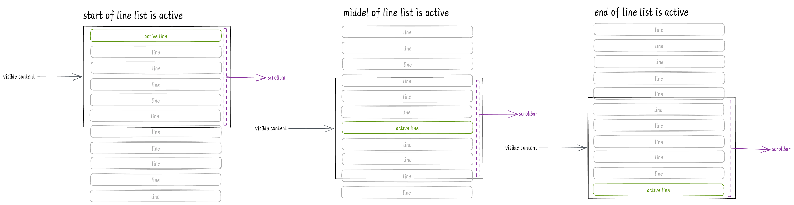
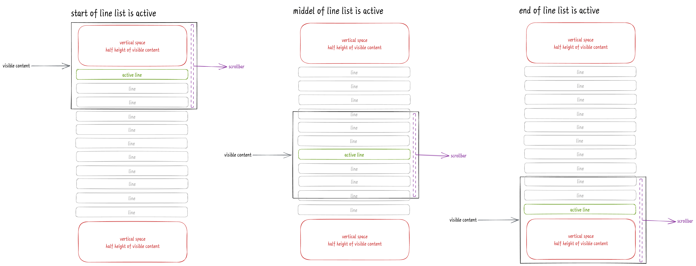

# react-lrc [](https://www.npmjs.com/package/react-lrc) [](https://github.com/mebtte/react-lrc/blob/master/LICENSE) [](https://bundlephobia.com/result?p=react-lrc)

The react component to display lyric from LRC. See [example](https://mebtte.github.io/react-lrc) or play on [CodeSandbox](https://codesandbox.io/s/3-playground-ku96gv).

## [2.x README](https://github.com/mebtte/react-lrc/blob/d714e64e5bb70a551b498559436fdd9f1d71f8ce/README.md)

## Feature

- Auto scroll smoothly
- Support multiple lrcs
- User srcollable
- Custom style
- Typescript support

## Install & Usage

```sh
npm install react-lrc
```

```jsx
import { Lrc } from 'react-lrc';

const Demo = () => {
  // ...
  return (
    <Lrc
      lrc={lrc}
      lineRenderer={lineRenderer}
      currentMillisecond={currentMillisecond}
    />
  );
};
```

## Reference

### Common Component Props

#### `lineRenderer`: ({ index: number, active: boolean, line: Line }) => React.ReactNode

The method to render every valid line of parsed lrc. `active` means whether it is current line. `Line` is `LrcLine` when using `Lrc` component or is `MultipleLrcLine` when `MultipleLrc`.

#### `currentMillisecond`?: number

Current time of lrc, default `-1`.

#### `verticalSpace`?: boolean

Make active line always vertical-middle even start or end of line list, default `false`.

without verticalSpace:



with verticalSpace:



#### `onLineUpdate`?: ({ index: number, line: Line | null }) => void

Call this when current line changed. `Line` is `LrcLine` when using `Lrc` component or is `MultipleLrcLine` when `MultipleLrc`.

#### `recoverAutoScrollInterval`

The interval of recovering auto scroll after user scrolling. It is `millisecond`, default `5000`.

#### `onAutoScrollChange`?: ({ autoScroll: boolean }) => void

There is a state which indicates whether or not it is auto-scroll, and which default value is `true`. When scrolling by user, it will be set to `false`. After `recoverAutoScrollInterval` milliseconds, it will be set to `true` automatically. `onAutoScrollChange` will be called when the state changed.

### Component `Lrc`

#### `lrc`: string

The lrc.

### Component `MultipleLrc`

#### `lrcs`: string[]

The lrc array.

### Hook `useRecoverAutoScrollImmediately`

When user scroll, `react-lrc` will stop auto scroll during `recoverAutoScrollInterval`. `useRecoverAutoScrollImmediately` helps recover auto scroll immediately.

```tsx
import { Lrc, useRecoverAutoScrollImmediately } from 'react-lrc';

const Demo = () => {
  const { signal, recoverAutoScrollImmediately } =
    useRecoverAutoScrollImmediately();

  return (
    <>
      <button type="button" onClick={recoverAutoScrollImmediately}>
        recover auto scroll immediately
      </button>
      <Lrc {...otherProps} recoverAutoScrollSingal={signal} />
    </>
  );
};
```

## Q & A

### How to prevent user scroll ?

```jsx
const style = { overflow: 'hidden !important' };

<Lrc style={style} recoverAutoScrollInterval={0} {...otherProps} />;
```

### How to hide scrollbar ?

```scss
.lrc {
  /* webkit */
  &::-webkit-scrollbar {
    width: 0;
    height: 0;
  }

  /* firefox */
  scrollbar-width: none;
}
```

```jsx
<Lrc className="lrc" {...otherProps} />
```

## License

[MIT](./LICENSE)
