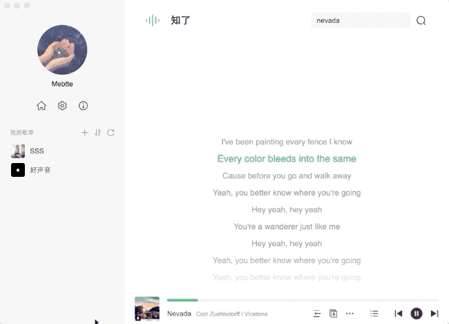

# react-lrc

The react component that display lyric from lrc format.

## Screenshot



## Feature

- Auto scroll smoothly
- User srcollable
- Custom style

## Requirement

- `react >= 16.8` with `hook`
- [ResizeObserver](https://caniuse.com/?search=ResizeObserver)

## Usage

```sh
npm install --save @mebtte/react-lrc
```

```jsx
import React, { useCallback } from 'react';
import { Lrc } from '@mebtte/react-lrc';

const Lyric = ({ lrc, currentTime }) => {
  const lineRenderer = useCallback(
    ({ lrcLine: { millisecond, content }, index, active }) => (
      <div style={{ textAlign: 'center', color: active ? 'green' : 'inherit' }}>
        {content}
      </div>
    ),
  );
  const onCurrentLineChange = useCallback(
    ({ lrcLine: { millisecond, content }, index }) =>
      console.log(index, millisecond, content),
    [],
  );

  return (
    <Lrc
      lrc={lrc}
      currentTime={currentTime}
      lineRenderer={lineRenderer}
      onCurrentLineChange={onCurrentLineChange}
    />
  );
};

export default Lyric;
```

### `Lrc` Props

| prop                      | description                                          | type                                                                                                             | default  |
| ------------------------- | ---------------------------------------------------- | ---------------------------------------------------------------------------------------------------------------- | -------- |
| lrc                       | lrc string                                           | string                                                                                                           | required |
| lineRenderer              | lrc line render method                               | ({ lrcLine: { id: string, millisecond: number, content: string }, index: number, active: boolean }) => ReactNode | required |
| currentTime               | current time                                         | number, **millisecond**                                                                                          | 0        |
| autoScroll                | whether auto scroll                                  | boolean                                                                                                          | true     |
| autoScrollAfterUserScroll | auto scroll after user scroll                        | number, **millisecond**                                                                                          | 6000     |
| spaceTop                  | space on lrc component top, percent of lrc component | number, 0~1                                                                                                      | 0.4      |
| onCurrentLineChange       | when current line change                             | ({ index: number, lrcLine: { id: string, millisecond: number, content: string }}) => void                        | null     |

### `Lrc` Methods

| method              | description                                | type                                                                                           |
| ------------------- | ------------------------------------------ | ---------------------------------------------------------------------------------------------- |
| scrollToCurrentLine | scroll to current line and set auto scroll | () => void                                                                                     |
| getCurrentLine      | get the current lrc line                   | () => { lrcLine: { id: string, millisecond: number, content: string }, index: number } \| null |

## Other API

### parseLrc

```jsx
import { parseLrc } from '@mebtte/react-lrc';

parseLrc(lrcString); // { id: string, millesecond: number: content: string }[]
```

### useLrc

```jsx
import React from 'react';
import { useLrc } from '@mebtte/react-lrc';

const Component = () => {
  const lrcLineList = useLrc(lrcString); // { id: string, millesecond: number: content: string }[]
  // ...
};
```

## Question

### How to prevent user scroll ?

```jsx
<Lrc
  style={{ overflow: 'hidden !important' }}
  autoScrollAfterUserScroll={0}
  {...otherProps}
/>
```

### How to hide scrollbar ?

```scss
.lrc {
  /* webkit */
  ::-webkit-scrollbar {
    width: 0;
  }

  /* firefox */
  scrollbar-width: none;

  /* ie */
  -ms-overflow-style: none;
}
```

```jsx
<Lrc className="lrc" {...otherProps} />
```

## License

MIT
